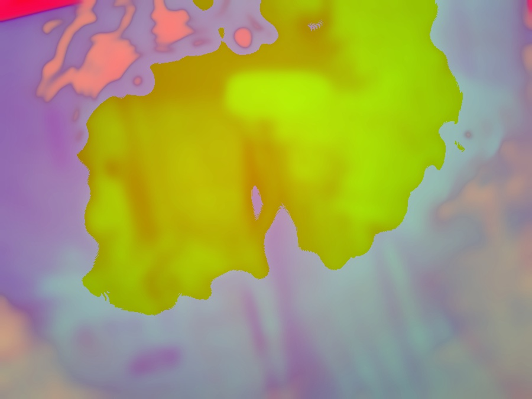
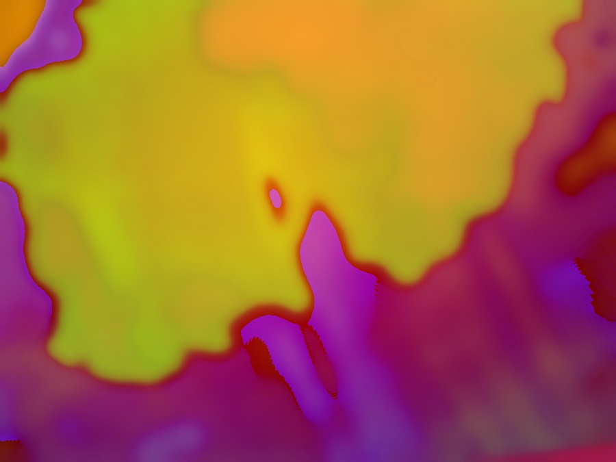
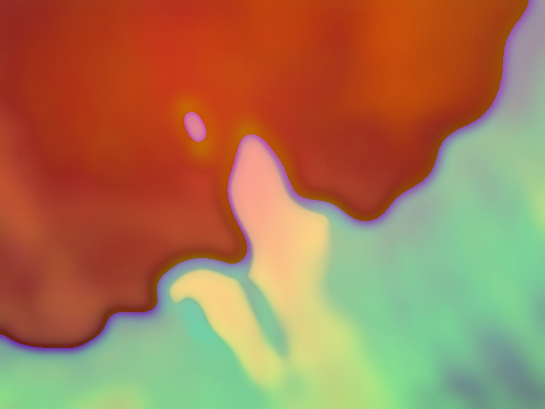
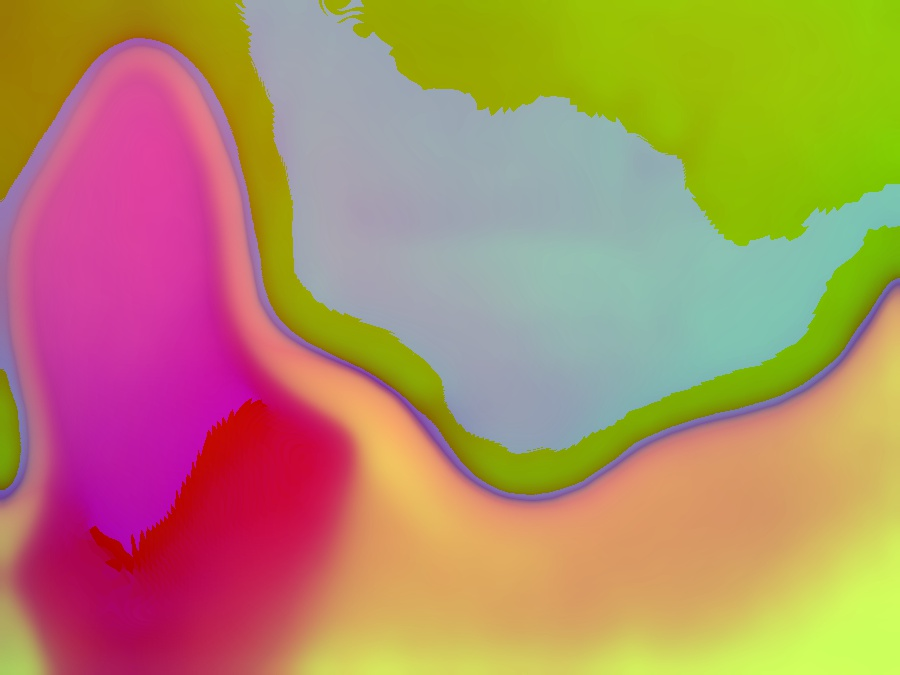

# OpenCV Webcam Play

This is the set up I occasionally use when I'm playing around with webcams and [OpenCV](https://opencv.org).

By turning the usb camera toward the monitor and in effect creating a video loop, you can achieve some beautiful trippy images like the ones below(these are actual frames grabbed using this method and code).

